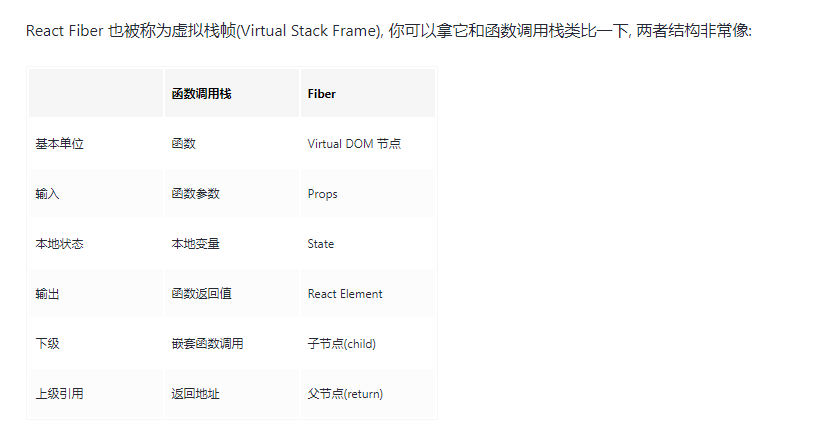

# React fiber

This template provides a minimal setup to get React working in Vite with HMR and some ESLint rules.

Currently, two official plugins are available:

- [@vitejs/plugin-react](https://github.com/vitejs/vite-plugin-react/blob/main/packages/plugin-react/README.md) uses [Babel](https://babeljs.io/) for Fast Refresh
- [@vitejs/plugin-react-swc](https://github.com/vitejs/vite-plugin-react-swc) uses [SWC](https://swc.rs/) for Fast Refresh
- [Fibre-递增对比](https://github.com/chinanf-boy/didact-explain/blob/master/5.Fibre.readme.md)
- [这可能是最通俗的 React Fiber(时间分片) 打开方式](https://juejin.cn/post/6844903975112671239)
- [build your own react](https://pomb.us/build-your-own-react/)



> ⚛️ 协调阶段: 可以认为是Diff 阶段，**这个阶段可以被中断, **  因为你是Diff 阶段， 所有你的中的不会给用户产生视觉上的影响。

```ts
    interface Fiber {
  /**
   * ⚛️ 节点的类型信息
   */
  // 标记 Fiber 类型, 例如函数组件、类组件、宿主组件
  tag: WorkTag,
  // 节点元素类型, 是具体的类组件、函数组件、宿主组件(字符串)
  type: any,

  /**
   * ⚛️ 结构信息
   */ 
  return: Fiber | null,
  child: Fiber | null,
  sibling: Fiber | null,
  // 子节点的唯一键, 即我们渲染列表传入的key属性
  key: null | string,

  /**
   * ⚛️ 节点的状态
   */
  // 节点实例(状态)：
  //        对于宿主组件，这里保存宿主组件的实例, 例如DOM节点。
  //        对于类组件来说，这里保存类组件的实例
  //        对于函数组件说，这里为空，因为函数组件没有实例
  stateNode: any,
  // 新的、待处理的props
  pendingProps: any,
  // 上一次渲染的props
  memoizedProps: any, // The props used to create the output.
  // 上一次渲染的组件状态
  memoizedState: any,


  /**
   * ⚛️ 副作用
   */
  // 当前节点的副作用类型，例如节点更新、删除、移动
  effectTag: SideEffectTag,
  // 和节点关系一样，React 同样使用链表来将所有有副作用的Fiber连接起来
  nextEffect: Fiber | null,

  /**
   * ⚛️ 替身
   * 指向旧树中的节点
   */
  alternate: Fiber | null,
}

```

## react-router
- hasRouter / BrowserRouter
    -  BrowserRouter 使用HTML5的History api 实现路由跳转
    - HashRouter 使用URL 的has属性控制路由跳转
## HOC
```js
  function 
```

## fiber
- 16.8 fiber 
```js

```
- VDOM ---> DOM renderer 渲染器
- reconciler 
- 同步不可中断 --》 异步可中断
2. scheduler --> 任务优先级
3. requestIdleCallback 

  